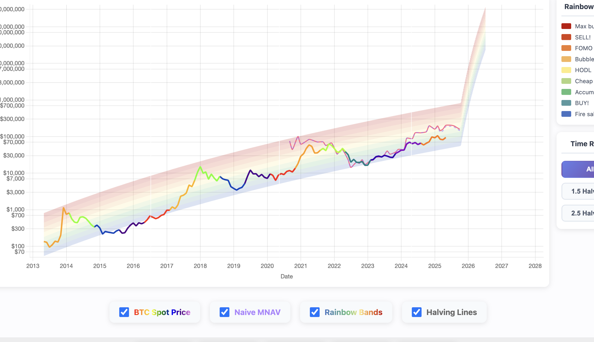

# Bitcoin Rainbow Chart with MSTR MNAV Comparison

A visualization tool comparing Bitcoin's spot price with MicroStrategy's MNAV-adjusted price using the rainbow chart model, featuring interactive component toggles for analyzing how debt and preferred stock affect the true enterprise value ratio.

🌐 **Live Demo: [https://strategyrainbow.com/](https://strategyrainbow.com/)**



## Features

- 🌈 Bitcoin rainbow bands showing market cycles (Fire Sale → Maximum Bubble)
- 📊 Compare BTC spot price vs MSTR MNAV-adjusted prices
- 🎯 Interactive toggles for debt and preferred stock components
- 📈 Naive MNAV (market cap only) vs Advanced MNAV (full enterprise value)
- ⚡ Bitcoin halving markers and halving-based zoom
- 🔄 Custom MNAV calculator with individual component selection
- 📱 Responsive design with compact sidebar layout

## Quick Start

### 1. Install Dependencies
```bash
npm install
```

### 2. Generate Data
```bash
npm run update-data
```
This reads the CSV files and generates `data.js`

### 3. Start Local Server
```bash
npm run serve
```
Then open http://localhost:8080 in your browser

## 📋 Steps to Update Data

Follow these steps to update the chart with fresh data:

### 1. Update Bitcoin Spot Price
- Download latest Bitcoin historical prices from a reliable source
- Ensure the CSV has columns: `date` (YYYY-MM-DD) and `btc_price_usd`
- Save as `btc_historical_prices.csv` in project root

### 2. Download MicroStrategy Data Files
Visit [MicroStrategy's Bitcoin Holdings page](https://www.microstrategy.com/bitcoin-holdings) and download:

**Primary file:**
- `MSTR.csv` - Main MicroStrategy data including market cap, debt, Bitcoin holdings

**Preferred stock series (if available):**
- `STRC.csv` - Series C Preferred Stock
- `STRD.csv` - Series D Preferred Stock
- `STRF.csv` - Series F Preferred Stock
- `STRK.csv` - Series K Preferred Stock

Place all CSV files in the project root directory.

### 3. Load Locally, Test, and Generate Data
```bash
# Install dependencies if not already installed
npm install

# Generate data.js from CSV files
npm run update-data

# Start local server to test
npm run serve
```

Open http://localhost:8080 and verify:
- ✅ All data series are loading correctly
- ✅ Toggle switches work for each component
- ✅ Custom MNAV updates when toggling debt/preferred options
- ✅ Zoom buttons (All, 1.5 Halvings, 2.5 Halvings) work properly

### 4. Generate Screenshot and Deploy

**Create preview image:**
1. Open the live site in your browser
2. Set a good zoom level showing recent data with rainbow bands
3. Take a screenshot (1200x630px ideal for social media)
4. Save as `preview.png` in project root

**Commit and push:**
```bash
# Add all updated files
git add *.csv preview.png

# Commit with descriptive message
git commit -m "Update data: [current date]"

# Push to GitHub
git push
```

The GitHub Actions workflow will automatically rebuild and deploy to GitHub Pages.

## Project Structure

```
├── index.html          # Main HTML file with component toggles
├── chart.js           # Chart logic, custom MNAV calculator
├── styles.css         # Styling with sidebar layout
├── data.js            # Generated data file (git-ignored)
├── update-data.js     # Data processing script
├── package.json       # Node.js dependencies
├── preview.png        # Social media preview image
├── MSTR.csv          # MicroStrategy main data
├── STR*.csv          # Preferred stock series data
├── btc_historical_prices.csv  # Bitcoin price history
└── README.md         # This file
```

## CSV Data Formats

### btc_historical_prices.csv
- `date` - Date in YYYY-MM-DD format
- `btc_price_usd` - Bitcoin price in USD

### MSTR.csv (from MicroStrategy)
Key columns used:
- `Date` - Date of data point
- `Market Cap` - Market capitalization
- `Debt` - Total debt
- `Pref` - Total preferred stock value
- `BTC` - Bitcoin holdings
- `BTC Price` - Bitcoin spot price on that date

### STR*.csv (Preferred Stock Series)
- `Date` - Date of data point
- `Series [C/D/F/K]` - Value of specific preferred stock series

## Development

### Available Scripts
- `npm run update-data` - Regenerate data.js from CSV files
- `npm run serve` - Start local development server
- `npm run dev` - Alias for serve

### Customizing Data Sources
Edit `update-data.js` to add remote data source URLs if needed.

## GitHub Pages Deployment

The site is automatically built and deployed to GitHub Pages via GitHub Actions. The workflow:

1. **Builds the site** - Installs npm dependencies and generates `data.js` from CSV files
2. **Deploys to Pages** - Publishes the complete site to GitHub Pages

### When it runs:
- ✅ Automatically on every push to `main` branch
- 🎯 On manual trigger from Actions tab

### Important:
- `data.js` is git-ignored locally but generated fresh during each deployment
- CSV data files must be committed to the repository
- No need to manually commit `data.js` - it's built automatically!

## License

MIT